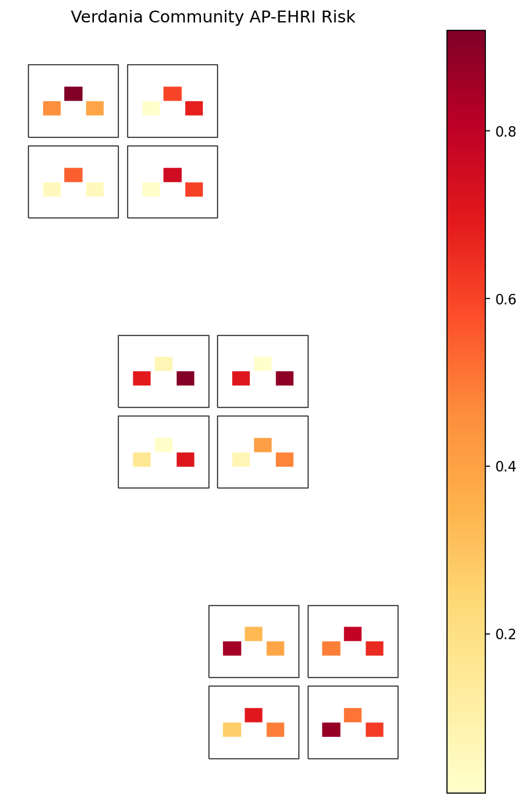
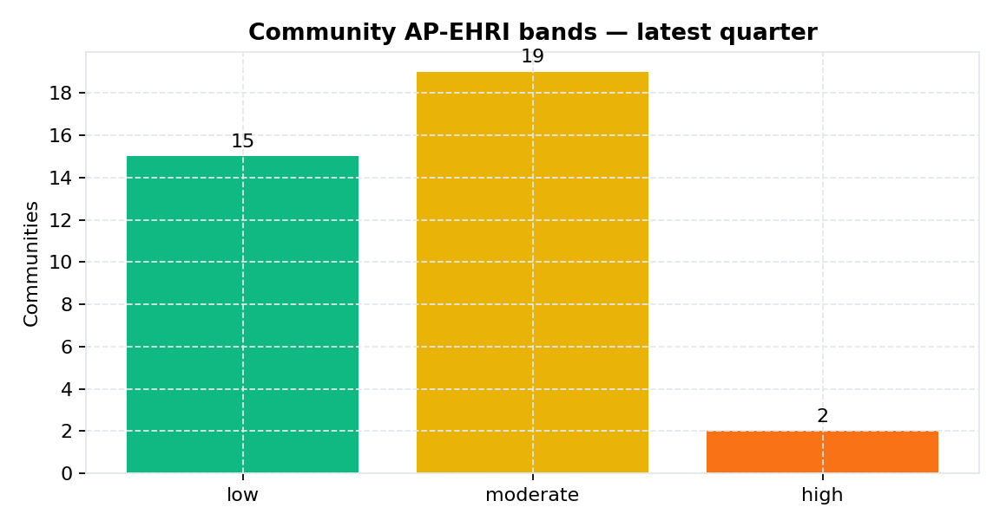
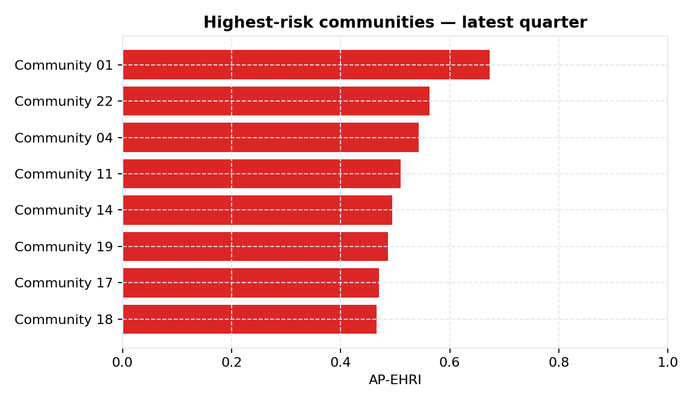
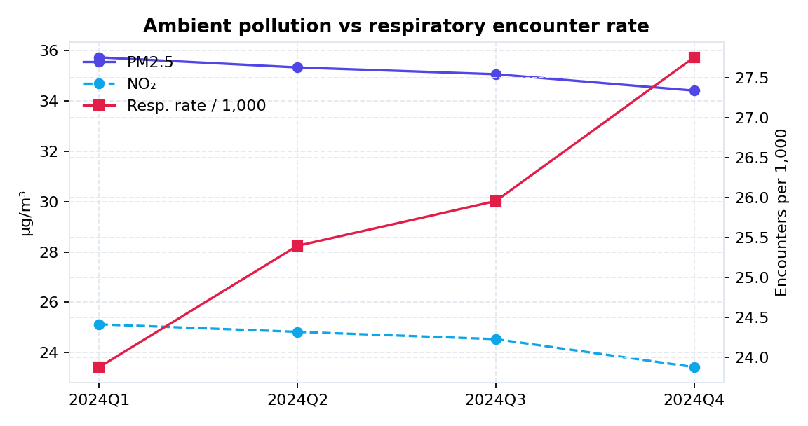
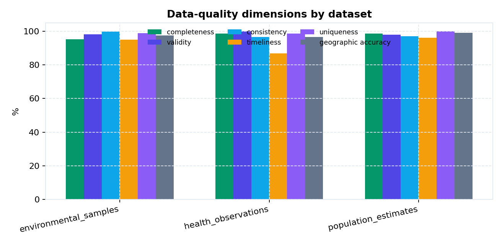
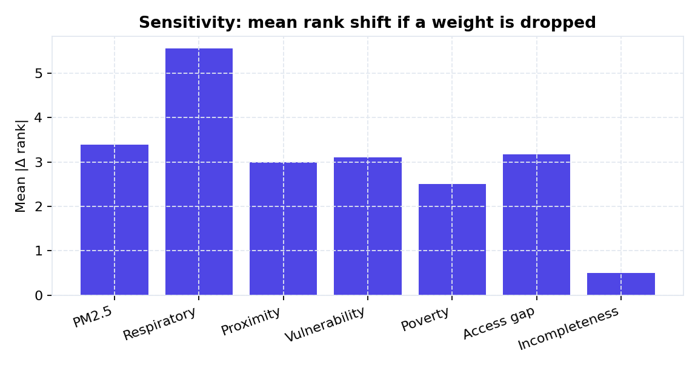
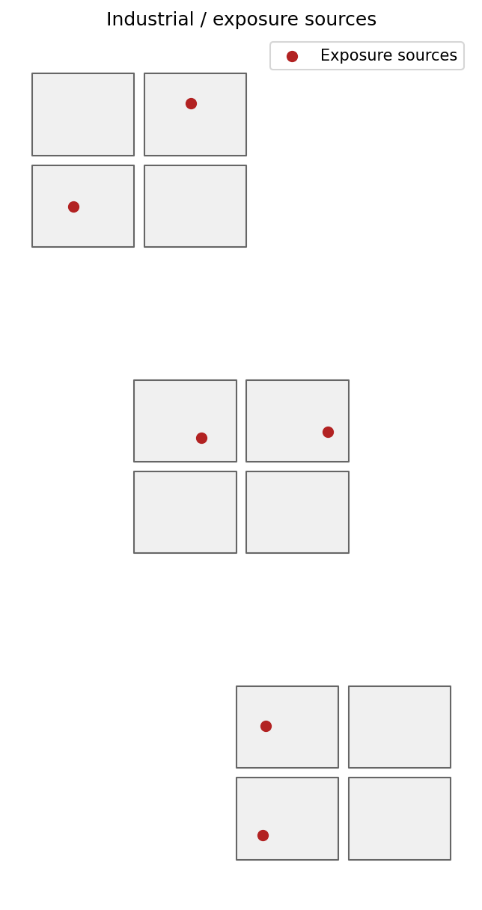
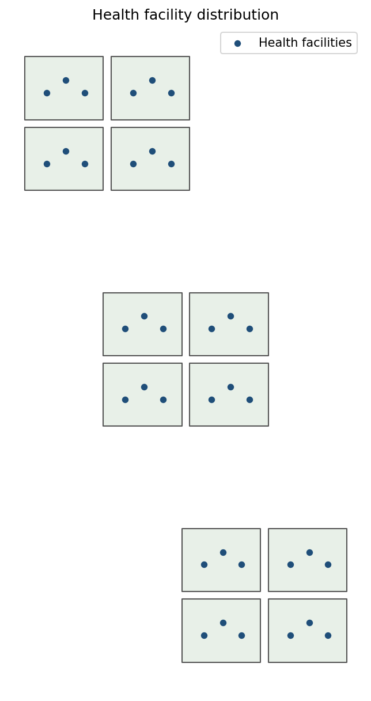

# EnviroLens

**Integrated environmental-health intelligence** — from messy multi-source data to a transparent geographic risk index, maps, and an analyst dashboard.

The MVP answers a real planning question for the fictional country **Verdania**:

> Which communities face the highest air-pollution-related health risk, how many vulnerable people live there, and where is the evidence too weak to act?

All records are **synthetic aggregates**. No patient-level data. Risk scores support public-health prioritization, not diagnosis.

<p align="center">
  
</p>
<p align="center"><em>Community-level Air Pollution Environmental-Health Risk Index (AP-EHRI)</em></p>

## Analyst briefing (what the dashboard says)

The Overview page writes a live briefing from the warehouse: high-risk population, hottest community, weakest district, **PM2.5 vs the WHO 2021 annual guideline (5 µg/m³)**, high-risk places with **no lab access**, and the weakest data feed.

| Risk mix | Highest-risk communities |
|:--------:|:------------------------:|
|  |  |

| Pollution vs health | Data quality |
|:-------------------:|:------------:|
|  |  |

## Weight lab and sensitivity (the “wow”)

AP-EHRI is a **documented weighted sum**, not a black box.

- **Weight lab** (`/explorer`) — drag sliders (PM2.5, respiratory burden, proximity, vulnerability, poverty, access, reporting gaps). Community ranks update instantly. Published PostgreSQL scores stay on methodology v1.0.
- **Sensitivity** — drop one component, re-normalize the rest, measure mean rank shift and top-5 retention.



**Interview line:** *I didn’t just plot PM2.5. I built a transparent index, showed how rankings move if policy weights change, and flagged where high risk meets missing lab access and weak reporting.*

## Geospatial intelligence

PostGIS distances, GeoPandas exports, Folium, and a QGIS project.

| Exposure sources | Health facilities |
|:----------------:|:-----------------:|
|  |  |

## What a reviewer should notice

| Capability | Why it matters |
|------------|----------------|
| Intentional dirty data + DQ engine | Missing values, bad geo codes, unit errors, duplicates, late reports |
| Transparent **AP-EHRI** | Weights, min-max normalization, missing-data rules, limitations |
| **Weight lab** | Live re-ranking without overwriting the warehouse |
| **Sensitivity analysis** | Rank shift when each component is dropped |
| PostGIS + GeoPandas maps | Proximity, choropleths, Folium, QGIS |
| FastAPI + Next.js | Queryable indicators, OpenAPI, chart-driven UI |
| R / Quarto path | Reproducible epidemiological reporting |

## Demo path (3 minutes)

1. Start PostGIS and run the pipeline (commands below)
2. **Overview** — briefing cards (WHO multiple, lab-access gaps)
3. **Weight lab** — raise poverty, watch ranks move
4. **Risk** — histogram, component radar, leave-one-out sensitivity
5. **Map** — choropleth + industrial sources + facilities

Dashboard: http://localhost:3001 · API: http://localhost:8000/docs  
Header: `X-API-Key: dev-api-key-change-me`

## AP-EHRI (v1.0)

```
AP-EHRI = 0.25·PM2.5 + 0.20·respiratory + 0.15·proximity
        + 0.15·vulnerability + 0.10·poverty + 0.10·access gap
        + 0.05·incompleteness
```

Components are min-max normalized within each reporting period.

Bands: low &lt; 0.35 · moderate · high ≥ 0.55 · very high ≥ 0.75.

Details: [`analysis/risk_model/README.md`](analysis/risk_model/README.md) · [`metadata/indicator_registry/indicators.md`](metadata/indicator_registry/indicators.md)

## Architecture

```text
Synthetic CSV / Excel / JSON / mock DHIS2
        │
        ▼
Python ETL + validation + DQ scores  (Prefect entrypoint)
        │
        ▼
PostgreSQL + PostGIS
        │
        ├── FastAPI  →  Next.js analytics UI  →  Power BI views
        ├── Python AP-EHRI + spatial joins
        └── R / Quarto reports
```

## Quick start

```bash
cp .env.example .env
docker compose up -d db redis
pip install -r requirements.txt
python -m synthetic_data.generators.generate_all
alembic upgrade head
python -m pipelines.run --all
python -m analysis.risk_model.calculate
python -m database.views.apply_views
python -m geospatial.generate_maps
bash scripts/copy_web_maps.sh
python scripts/export_readme_figures.py
uvicorn api.main:app --reload
```

```bash
cd dashboards/web && cp .env.local.example .env.local && npm install && npm run dev
```

PostGIS **5433** · Redis **6380** · API **8000** · Web **3001**

Refresh README figures after a new pipeline run: `python scripts/export_readme_figures.py`

## Stack

Python · FastAPI · SQLAlchemy · Alembic · Pandas · Prefect · PostgreSQL/PostGIS · GeoPandas · R/Quarto · Next.js · Recharts · Docker · GitHub Actions · mock DHIS2

## Privacy

Synthetic, aggregated, no PII. See [`docs/data_governance.md`](docs/data_governance.md).

## License

MIT — [LICENSE](LICENSE)
