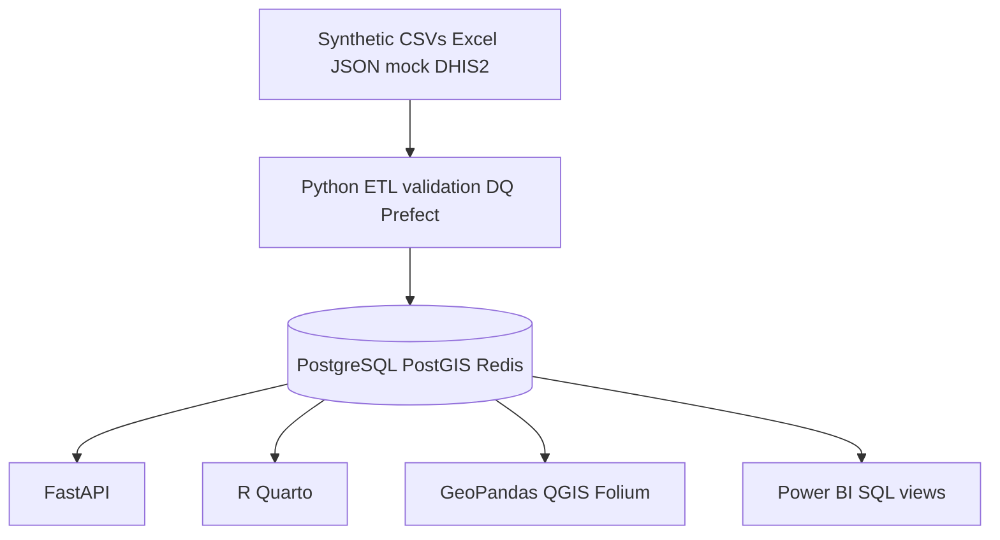
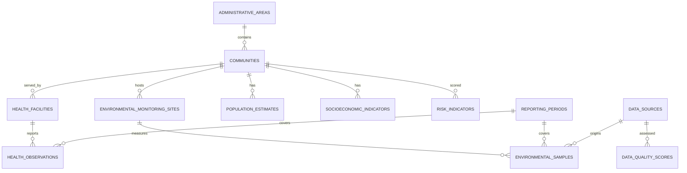

# EnviroLens Technical Architecture

## Context

EnviroLens MVP demonstrates an integrated environmental-health intelligence platform for ambient air pollution (PM2.5 / NO₂) and respiratory outcomes in the fictional country **Verdania**.

## Component diagram

## Entity-relationship overview

## Runtime services

| Service | Image / process | Port |
|---------|-----------------|------|
| PostGIS | postgis/postgis:16-3.4 | 5432 |
| Redis | redis:7-alpine | 6379 |
| API | uvicorn api.main:app | 8000 |

## Security (MVP)

- API key header (`X-API-Key`) with role stub (admin / analyst / viewer)
- Audit log table for import / validate / risk actions
- Synthetic aggregate data only

## Deployment note

Local Docker Compose is the supported MVP path. AWS deployment (ECS/RDS) is documented as a future Phase 7 activity.
